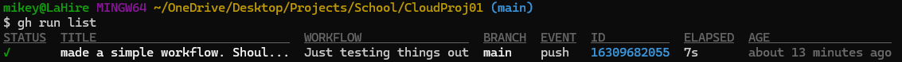
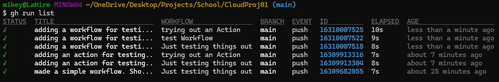

# ITCLOUD2026 Project 01

>Simple GitHub project. 

## What was done?

The project outline was pretty simple. It directed me to create a GitHub account, create a new repository, clone it locally, and then go through the process of adding a action, workflow, and variable using the GUI. To spice things up a bit I decided to do it all through the CLI. I ran into a few issues, when I initailly made the repo I did it locally and didn't create it on GitHub and had to troubleshoot why it wouldn't allow me to commit. I felt a little goofy once I realized it was because I was trying to commit to a repo that only existed locally. Once I got that sorted I created the .github/workflows dir and began with a variable yml. I tried to keep it simple and used followed the [GitHub doclink](https://docs.github.com/en/actions/how-tos/writing-workflows/choosing-what-your-workflow-does/store-information-in-variables) on creating one. From there I tried to test it in my CLI (Git Bash) but realized I hadn't made GitHub CLI (gh) an alias yet. So using powershell I located where I downloaded it a while back, and then added the path to bashrc, ran source to refresh it, and then checking in the Git Bash cli to make sure it was accessible now. Thankfully it worked out and I was able to do my first test on the variable.



From here I went ahead and created a action and then a workflow successfully, again following GitHub Documentation on both [actions](https://docs.github.com/en/actions/get-started/quickstart), and [workflows](https://docs.github.com/en/actions/how-tos/writing-workflows).



To finish the project up I decided to add a file structure and link all of the resources used to complete this here in the README.md.

## Project Structure

```text
|-- .git
|   |-- COMMIT_EDITMSG
|   |-- HEAD
|   |-- config
|   |-- description
|   |-- hooks
|   |   |-- ....
|   |-- index
|   |-- info
|   |   `-- ....
|   |-- logs
|   |   |-- HEAD
|   |   `-- refs
|   |       |-- ....
|   |-- objects
|   |   |-- 32
|   |   |   `-- ....
|   |   |-- info
|   |   `-- pack
|   `-- refs
|       |-- heads
|       |   `-- main
|       |-- remotes
|       |   `-- origin
|       |       `-- main
|       `-- tags
|-- .github
|   `-- workflows
|       |-- main.yml
|       |-- test-action.yaml
|       `-- test-workflow.yml
`-- README.md

34 directories, 47 files
```

## What's next?

As I come across things I want to practice, log, or showcase on GitHub I will add them here. The end goal is to become more familiar with GitHub and quickly using git commands from the cli to interact with repositories.

-jlahire
